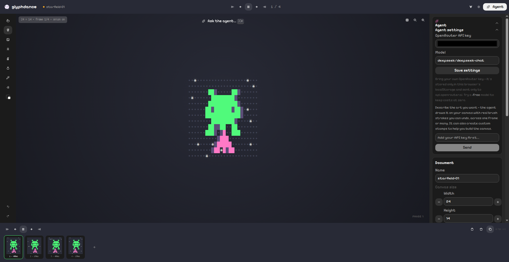

# glyphdance

An agentically powered ASCII art animation studio. Compose multi-frame ASCII
animations on a character grid — by hand, or with an AI co-pilot that can do
anything you can do: add frames, paint cells, place stamps, build animated
stamps, and compose full scenes.

**Try it:** [glyphdance.vercel.app](https://glyphdance.vercel.app)



## What it does

- **Character-grid canvas** — paint with 2,700+ Cozette glyphs across 4 monospace fonts
- **Frame timeline** — multi-frame animation with per-frame hold times, onion skinning
- **Stamp library** — 20+ built-in stamps (invaders, critters, clouds, trees, flowers) plus your own custom stamps, including animated ones made from selections
- **AI co-pilot** — chat with an agent that edits the canvas through the same validated action layer as the UI (BYO OpenRouter key, stored locally)
- **Export** — PNG (2×), animated GIF, TXT, and lossless JSON of all frames
- **PWA** — installable, works offline, documents persist in localStorage

## The JSON format

**JSON · all frames** exports a complete, lossless representation of every frame:
characters, per-cell foreground/background colors, hold times, and the active font.

```json
{
  "kind": "glyphdance-frames",
  "width": 24,
  "height": 14,
  "frames": [["..."]],
  "holdMs": [500],
  "fgMap": [[["#4ade80"]]],
  "bgMap": [[["#2b4a2f"]]]
}
```

Send it to the agent to replicate stamps, or render it anywhere with the
standalone renderer in [`renderer/`](renderer/) — dependency-free, framework-free:

```ts
import { playFrames } from './glyphdance-renderer.js';
const player = playFrames(canvas, data); // respects holdMs, loops forever
```

See [`renderer/README.md`](renderer/README.md) for the full schema and a
drag-and-drop demo page.

## Develop

```sh
npm install
npm run dev
```

Pushes to `main` deploy automatically via Vercel.

## Stack

React 19 + Vite + TypeScript, Astryx UI, StyleX. Fonts: Cozette, IBM VGA,
JetBrains Mono, System Mono. Built with Muse.

## License

MIT — see [LICENSE](LICENSE).
